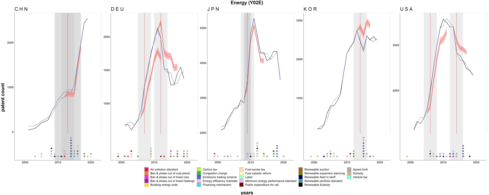
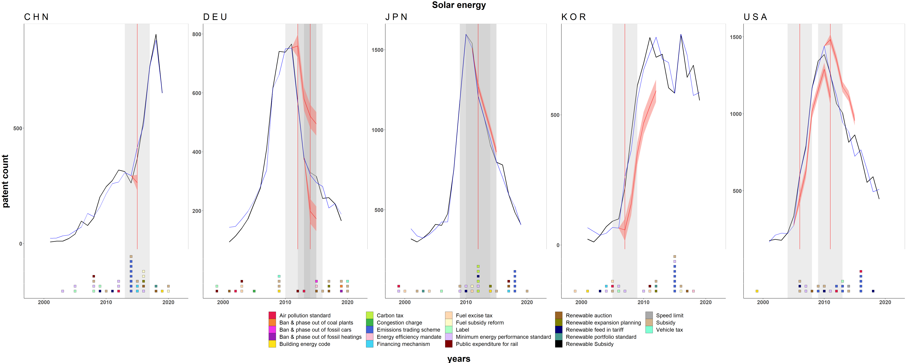
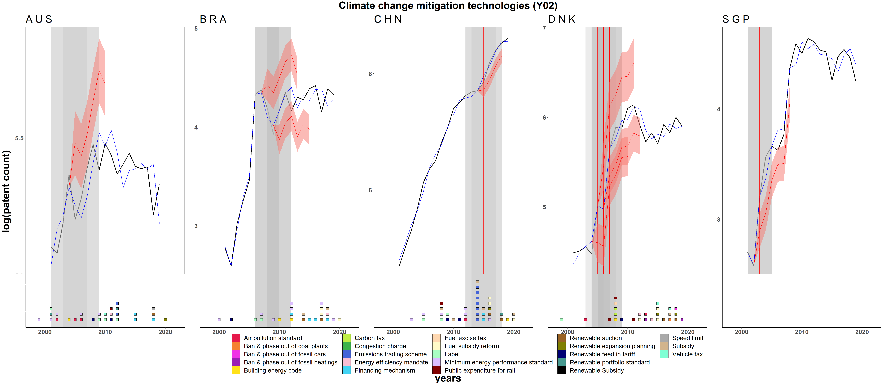
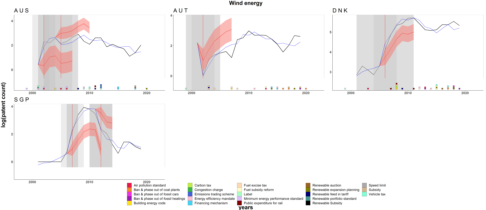

```{r, fig.height = 15, fig.width = 15, echo=FALSE}

## libraries
suppressWarnings(suppressMessages(library(knitr)))
suppressWarnings(suppressMessages(library(tidyverse)))
suppressWarnings(suppressMessages(library(kableExtra)))
suppressWarnings(suppressMessages(library(patchwork)))
suppressWarnings(suppressMessages(library(gets)))
suppressWarnings(suppressMessages(library(getspanel)))
suppressWarnings(suppressMessages(library(here)))
suppressWarnings(suppressMessages(library(doParallel)))
suppressWarnings(suppressMessages(library(gdata)))
suppressWarnings(suppressMessages(library(gridExtra)))
suppressWarnings(suppressMessages(library(ggridges)))

# Load plotting functions
source("C:\\Users\\laura\\OneDrive\\Documenti\\LAURA\\MCC\\futurelab_ceres\\patent_data_project\\code\\plotting_functions.R")

# Data
top_25 <- c("JPN", "USA", "KOR", "DEU", "CHN", "FRA", "GBR", "TWN", "CAN", "ITA", "DNK", "NLD", "IND", "AUT", "CHE", "SWE", "ESP", "AUS", "ISR", "BEL", "FIN", "RUS", "NOR", "SGP", "BRA")

df <- read_csv("C:\\Users\\laura\\OneDrive\\Documenti\\LAURA\\MCC\\futurelab_ceres\\patent_data_project\\data\\patents_panel_5techs.csv", show_col_types = F)  %>% filter(ISO %in% top_25)

# 05.02-24 Model results

res <- readRDS("C:\\Users\\laura\\OneDrive\\Documenti\\LAURA\\MCC\\futurelab_ceres\\patent_data_project\\results\\05_02_all.RDS") %>% 
  separate(source, into = c("dep","formula"), sep = "[~]", remove = FALSE) %>%
  mutate(dep = str_to_title(gsub("_"," ",trimws(dep))),
         formula = trimws(formula), 
         tech = word(dep, -1, sep = " ")) 

```

## Models comparison {.tabset}

 * Y: Levels, Logs+1, IHS, **Normalization with the max by technology**
 * Controls: gdp, pop
 * Auto-regressive term = 1
 * IIS=ON
 * p-val = 0.01, 0.05
 * Sample: top_25
 * Time series: 2000-2019

```{r models, echo=FALSE, results = 'asis', fig.height=40, fig.width=60, cache = TRUE}

res %>%
       dplyr::group_split(tech) %>%
       purrr::iwalk(.,~{
         name <- unique(.x$tech)
         cat('### ', name, '{.tabset}   \n')
              for(p in unique(.x$dep)){
                   cat('#### ', p, '{.tabset}   \n')
                for(sm in unique(.x$p_val)){
                   cat('##### ', sm, '{.tabset}   \n')
                   filter(.x, p_val == sm & dep == p) %>% gen_p(., auto = TRUE)
                cat('\n')
                cat('\n')
                }
           cat('\n')
           cat('\n')
           }
         cat('\n')
         cat('\n')
       })
       
```


## Policy matching results {.tabset}

### Count {.tabset}

#### Ccmt {.tabset}

```{r, echo=FALSE, out.width = '100%'}

knitr::include_graphics("Fig_ccmt_lowres.png")
```

#### Energy {.tabset}

```{r, echo=FALSE, out.width = '100%'}


```


#### Solar {.tabset}

```{r, echo=FALSE, out.width = '100%'}


```

#### Wind {.tabset}

```{r, echo=FALSE, out.width = '100%'}

knitr::include_graphics("Fig_wind.png")
```

### Logs {.tabset}

#### Ccmt {.tabset}

```{r, echo=FALSE, out.width = '100%'}


```

#### Energy {.tabset}

```{r, echo=FALSE, out.width = '100%'}

knitr::include_graphics("Fig_energy_logs.png")
```


#### Solar {.tabset}

```{r, echo=FALSE, out.width = '100%'}

knitr::include_graphics("Fig_solar_logs.png")
```

#### Wind {.tabset}

```{r, echo=FALSE, out.width = '100%'}


```


## Breaks comparison {.tabset}

 * Common countries across specifications (count vs log): China, South Korea, Denmark

### Country comparison across techs and specifications: 

#### Count (6 countries in tot): {.tabset}

```{r, echo=FALSE}
country_comp_count <- data.frame(country = c("China", "Germany", "Japan", "South Korea", "USA", "Denmark"), 
                           ccmt = c("x","x","x","x","x", ""),
                           energy = c("x","x","x","x","x", ""), 
                           solar = c("x","x","x","x","x", ""),
                           wind = c("","x", "", "", "x", "x")
                           )

country_comp_count %>% 
  kbl() %>%
  kable_material(c("striped", "hover"))

```


#### Log (10 countries in tot): {.tabset}

```{r, echo=FALSE}
country_comp_log <- data.frame(country = c("Australia", "Brasil", "China", "Denmark", "Singapore","Spain", "Russia", "South Korea", "Taiwan", "Austria"), 
                           ccmt = c("x","x","x","x","x", "", "", "","",""),
                           energy = c("", "", "x", "x", "x", "x", "x", "", "", ""), 
                           solar = c("x", "x", "", "", "", "x", "x", "x", "x", ""),
                           wind = c("x", "", "", "x", "x", "", "", "","","x")
                           )

country_comp_log %>% 
  kbl() %>%
  kable_material(c("striped", "hover")) %>% 
  kable_styling(fixed_thead = T)
```


### Sign comparison across techs and specifications: 

#### Count: {.tabset}

```{r, echo=FALSE, results='asis'}
sign_comp_count <- data.frame(country = c("China", "Germany", "Japan", "South Korea", "USA", "Denmark"), 
                           ccmt = c("+","+-","-+","+","++-", ""),
                           energy = c("+","+-","+","-","+-", ""), 
                           solar = c("+","-+","-","+","+-", ""),
                           wind = c("","+", "", "", "-+-", "+--")
                           )

# Function to format cells with "+" and "-"
format_sign_cells <- function(x) {
  cell_spec(x, "html", color = "black", bold = TRUE)
}

# Apply the formatting function to the entire data frame
formatted_table <- sign_comp_count %>%
  mutate_all(format_sign_cells)

formatted_table %>% 
  kable(escape = FALSE) %>%
  kable_material(c("striped", "hover"))

```


#### Log: {.tabset}


```{r, echo=FALSE, results='asis'}
sign_comp_log <- data.frame(country = c("Australia", "Brasil", "China", "Denmark", "Singapore","Spain", "Russia", "South Korea", "Taiwan", "Austria"), 
                           ccmt = c("-","-+","+","+-+","+", "", "", "","",""),
                           energy = c("", "", "+", "+", "+-+", "+", "-", "", "", ""), 
                           solar = c("-", "+", "", "", "", "+", "-", "+", "+", ""),
                           wind = c("+-", "", "", "+", "+-", "", "", "","","-")
                          )

# Function to format cells with "+" and "-"
format_sign_cells <- function(x) {
  cell_spec(x, "html", color = "black", bold = TRUE)
}

# Apply the formatting function to the entire data frame
formatted_table <- sign_comp_log %>%
  mutate_all(format_sign_cells)

formatted_table %>% 
  kable(escape = FALSE) %>%
  kable_material(c("striped", "hover")) %>% 
  kable_styling(fixed_thead = T)
```


### Year comparison:

#### Count: {.tabset}

```{r, echo=FALSE}
year_comp_count <- data.frame(country = c("China", "Germany", "Japan", "South Korea", "USA", "Denmark"), 
                           ccmt = c("2013","2006, 2012","2008, 2009","2009","2005, 2012, 2014", ""),
                           energy = c("2013","2007, 2012","2009","2014","2006, 2014", ""), 
                           solar = c("2015","2012, 2014","2012","2007","2006, 2011", ""),
                           wind = c("","2006", "", "", "2013, 2015, 2017", "2007, 2012, 2018")
                           )

year_comp_count %>% 
  kbl() %>%
  kable_material(c("striped", "hover"))

```


#### Log: {.tabset}


```{r, echo=FALSE}
sign_comp_log <- data.frame(country = c("Australia", "Brasil", "China", "Denmark", "Singapore","Spain", "Russia", "South Korea", "Taiwan", "Austria"), 
                           ccmt = c("2005","2008, 2010","2015","2005, 2006, 2007","2003", "", "", "","",""),
                           energy = c("", "", "2015", "2005", "2003, 2006, 2007", "2003", "2007", "", "", ""), 
                           solar = c("2005", "2014", "", "", "", "2003", "2019", "2007", "2006", ""),
                           wind = c("2002, 2005", "", "", "2006", "2007, 2012", "", "", "","","2002")
                           )

sign_comp_log %>% 
  kbl() %>%
  kable_material(c("striped", "hover"))%>% 
  kable_styling(fixed_thead = T)
```